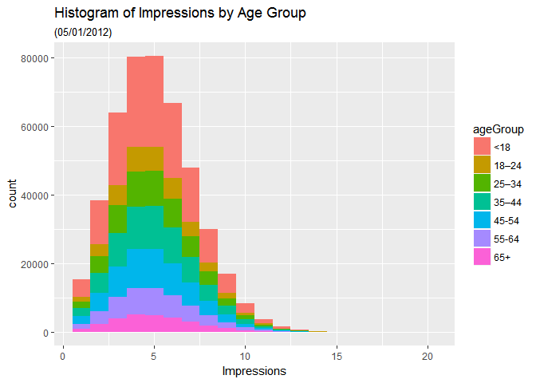
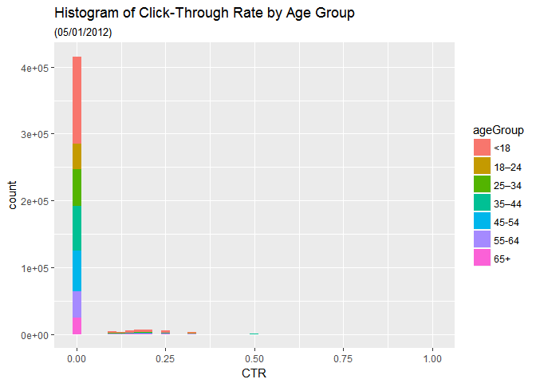
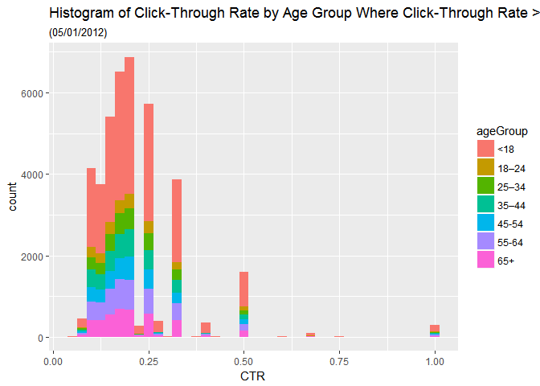
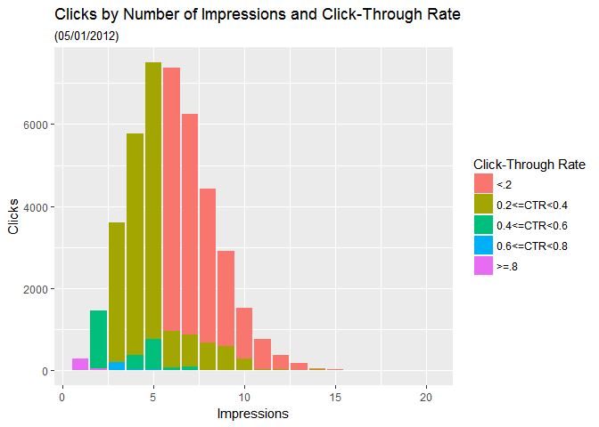

# Week 10 Assignment
Paul Panek  
July 18, 2017  


```r
setwd("C:\\Users\\X\\Documents\\SMU\\DoingDataScience\\Week10\\PPanek_Week10_Assignment")
library(ggplot2) 
library(plyr) 
```
## Item 1: getting the data and saving as data1

```r
fileLocation <- "http://stat.columbia.edu/~rachel/datasets/nyt1.csv"
data1 <- read.csv(url(fileLocation))
head(data1)
```

```
##   Age Gender Impressions Clicks Signed_In
## 1  36      0           3      0         1
## 2  73      1           3      0         1
## 3  30      0           3      0         1
## 4  49      1           3      0         1
## 5  47      1          11      0         1
## 6  47      0          11      1         1
```

```r
str(data1)
```

```
## 'data.frame':	458441 obs. of  5 variables:
##  $ Age        : int  36 73 30 49 47 47 0 46 16 52 ...
##  $ Gender     : int  0 1 0 1 1 0 0 0 0 0 ...
##  $ Impressions: int  3 3 3 3 11 11 7 5 3 4 ...
##  $ Clicks     : int  0 0 0 0 0 1 1 0 0 0 ...
##  $ Signed_In  : int  1 1 1 1 1 1 0 1 1 1 ...
```
## Item 2: Create a new variable ageGroup that categorizes age into following groups: 
###< 18, 18–24, 25–34, 35–44, 45–54, 55–64 and 65+.

```r
data1$ageGroup[data1$Age<18]<-"<18"
data1$ageGroup[data1$Age>=18 & data1$Age <25] <- "18–24"
data1$ageGroup[data1$Age>=25 & data1$Age <35] <- "25–34"
data1$ageGroup[data1$Age>=35 & data1$Age <45] <- "35–44"
data1$ageGroup[data1$Age>=45 & data1$Age <55] <- "45-54"
data1$ageGroup[data1$Age>=55 & data1$Age <65] <- "55-64"
data1$ageGroup[data1$Age>=65] <- "65+"
head(data1)
```

```
##   Age Gender Impressions Clicks Signed_In ageGroup
## 1  36      0           3      0         1    35–44
## 2  73      1           3      0         1      65+
## 3  30      0           3      0         1    25–34
## 4  49      1           3      0         1    45-54
## 5  47      1          11      0         1    45-54
## 6  47      0          11      1         1    45-54
```
## Item 3:	Use sub set of data called “ImpSub” where Impressions > 0 ) in your data set

```r
ImpSub<-data1[data1$Impressions>0,]
dim(ImpSub)
```

```
## [1] 455375      6
```
## Item 4:  Create a new variable called click-through-rate (CTR = click/impression)
### Intentionally doing this only for ImpSub

```r
ImpSub$CTR <- ImpSub$Clicks/ImpSub$Impressions
dim(ImpSub)
```

```
## [1] 455375      7
```

```r
head(ImpSub)
```

```
##   Age Gender Impressions Clicks Signed_In ageGroup        CTR
## 1  36      0           3      0         1    35–44 0.00000000
## 2  73      1           3      0         1      65+ 0.00000000
## 3  30      0           3      0         1    25–34 0.00000000
## 4  49      1           3      0         1    45-54 0.00000000
## 5  47      1          11      0         1    45-54 0.00000000
## 6  47      0          11      1         1    45-54 0.09090909
```
##  Item 5:  Plot distributions of number impressions and click-through-rate (CTR = click/impression) for the age groups.
### Using ImpSub

```r
Impressions <- ggplot(ImpSub, aes(x=Impressions, fill=ageGroup))+
  labs(title="Histogram of Impressions by Age Group",subtitle= "(05/01/2012)")+
  geom_histogram(binwidth=1)
Impressions
```

<!-- -->

```r
Clickthrough <- ggplot(ImpSub, aes(x=CTR, fill=ageGroup))+
  labs(title="Histogram of Click-Through Rate by Age Group",subtitle= "(05/01/2012)")+
  geom_histogram(binwidth=.025)
Clickthrough
```

<!-- -->

```r
ClickthroughGT0 <- ggplot(subset(ImpSub, CTR>0), aes(x=CTR, fill=ageGroup))+
  labs(title="Histogram of Click-Through Rate by Age Group Where Click-Through Rate >0",subtitle= "(05/01/2012)")+
  geom_histogram(binwidth=.025)
ClickthroughGT0
```

<!-- -->

## Item 6: Define a new variable to segment users based on click -through-rate (CTR) behavior.
###  CTR< 0.2, 0.2<=CTR <0.4, 0.4<= CTR<0.6, 0.6<=CTR<0.8, CTR>0.8

```r
ImpSub$CTR_Group[ImpSub$CTR<.2]<-"<.2"
ImpSub$CTR_Group[ImpSub$CTR>=.2 & ImpSub$CTR <.4] <- "0.2<=CTR<0.4"
ImpSub$CTR_Group[ImpSub$CTR>=.4 & ImpSub$CTR <.6] <- "0.4<=CTR<0.6"
ImpSub$CTR_Group[ImpSub$CTR>=.6 & ImpSub$CTR <.8] <- "0.6<=CTR<0.8"
ImpSub$CTR_Group[ImpSub$CTR>=.8] <- ">=.8"
head(ImpSub)
```

```
##   Age Gender Impressions Clicks Signed_In ageGroup        CTR CTR_Group
## 1  36      0           3      0         1    35–44 0.00000000       <.2
## 2  73      1           3      0         1      65+ 0.00000000       <.2
## 3  30      0           3      0         1    25–34 0.00000000       <.2
## 4  49      1           3      0         1    45-54 0.00000000       <.2
## 5  47      1          11      0         1    45-54 0.00000000       <.2
## 6  47      0          11      1         1    45-54 0.09090909       <.2
```
## Question 7 Get the total number of Male, Impressions, Clicks and Signed_In

```r
Males <- sum(ImpSub$Gender)
names(Males)<-"Males"
Q7 <- c(Males,sapply(ImpSub[c(3,4,5)],sum))
Q7
```

```
##       Males Impressions      Clicks   Signed_In 
##      167146     2295559       42449      319198
```
## Question 8 Get the mean of Age, Impressions, Clicks, CTR and percentage of males and signed_In
## Perform thecalculations, create a vector from the results, then assign appropriate names.

```r
means <- sapply(ImpSub[c("Age", "Impressions", "Clicks", "CTR")], mean)
pcts <- sapply(ImpSub[c("Gender", "Signed_In")], function(x){sum(x) / NROW(x)})
Q8<-c(means, pcts)
names(Q8)<- c("Mean_Age","Mean_Impressions","Mean_Clicks", "Mean_CTR", "Pct_Male", "PCT_Signed_In")
Q8
```

```
##         Mean_Age Mean_Impressions      Mean_Clicks         Mean_CTR 
##      29.48400988       5.04102992       0.09321768       0.01847053 
##         Pct_Male    PCT_Signed_In 
##       0.36705133       0.70095635
```
## Item 9  Get the means of Impressions, Clicks, CTR and percentage of males and signed_In  by AgeGroup.

```r
ImpSub$ageGroup<-as.factor(ImpSub$ageGroup)
Mean_Age<-tapply(ImpSub$Age,ImpSub$ageGroup,mean)
Mean_Impress<-tapply(ImpSub$Impressions,ImpSub$ageGroup,mean)
Mean_Clicks<-tapply(ImpSub$Clicks,ImpSub$ageGroup,mean)
Mean_CTR<-tapply(ImpSub$CTR,ImpSub$ageGroup,mean)
Pct_Male<-tapply(ImpSub$Gender,ImpSub$ageGroup,function(x){sum(x) / NROW(x)})
Pct_Signed_in<-tapply(ImpSub$Signed_In,ImpSub$ageGroup,function(x){sum(x) / NROW(x)})

Q9<-data.frame(Mean_Age, Mean_Impress, Mean_Clicks, Mean_CTR, Pct_Male,Pct_Signed_in)
names(Q9)<-c("Mean_Age","Mean_Impress","Mean_Clicks","Mean_CTR","Pct_Male","Pct_Signed_In")
Q9
```

```
##        Mean_Age Mean_Impress Mean_Clicks    Mean_CTR   Pct_Male
## <18    1.397948     5.034534  0.14372052 0.028530995 0.06270471
## 18–24 20.832187     5.038235  0.05362799 0.010733764 0.53395367
## 25–34 29.503573     5.026055  0.05081227 0.010146329 0.53199772
## 35–44 39.493195     5.054749  0.05202148 0.010286330 0.53170725
## 45-54 49.492928     5.045172  0.05062260 0.009957612 0.52921920
## 55-64 59.497459     5.053484  0.10246952 0.020306816 0.53596329
## 65+   72.988409     5.046925  0.15233226 0.029802702 0.36325116
##       Pct_Signed_In
## <18      0.09160224
## 18–24    1.00000000
## 25–34    1.00000000
## 35–44    1.00000000
## 45-54    1.00000000
## 55-64    1.00000000
## 65+      1.00000000
```

```r
# Sanity-checking the counts and sums for Signed_In since all but first group were at 100%.
tapply(ImpSub$Signed_In,ImpSub$ageGroup,sum)
```

```
##   <18 18–24 25–34 35–44 45-54 55-64   65+ 
## 13732 40408 57801 70394 63845 44462 28556
```

```r
tapply(ImpSub$Signed_In,ImpSub$ageGroup,NROW)
```

```
##    <18  18–24  25–34  35–44  45-54  55-64    65+ 
## 149909  40408  57801  70394  63845  44462  28556
```

```r
sum(tapply(ImpSub$Signed_In,ImpSub$ageGroup,NROW))
```

```
## [1] 455375
```

```r
dim(ImpSub)
```

```
## [1] 455375      8
```
## Item 10:  Create a table of CTRGroup vs AgeGroup counts.

```r
Display_Order<-c("<.2","0.2<=CTR<0.4","0.4<=CTR<0.6","0.6<=CTR<0.8",">=.8")
ImpSub$CTR_Group<-factor(ImpSub$CTR_Group, levels = Display_Order)
Q10<-with(ImpSub, tapply(Age, list(ageGroup,CTR_Group), NROW)) # Using age to count, choice of variable is meaningless because there are no NAs
Q10
```

```
##          <.2 0.2<=CTR<0.4 0.4<=CTR<0.6 0.6<=CTR<0.8 >=.8
## <18   139801         8724         1143           83  158
## 18–24  39431          858           99            3   17
## 25–34  56462         1203          110            7   19
## 35–44  68749         1489          124            4   28
## 45-54  62369         1331          125           NA   20
## 55-64  42424         1793          201            8   36
## 65+    26587         1742          195           11   21
```
## Item 11: Plot distributions of number impressions and click-through-rate (CTR = click/impression) for the age groups
### Same as Item 5.

## Item 12:  One more plot you think which is important to look at.

```r
ggplot(ImpSub,aes(x=Impressions, y=Clicks,fill=CTR_Group))+geom_bar(stat="identity")+labs(x="Impressions", y="Clicks",title = "Clicks by Number of Impressions and Click-Through Rate",subtitle= "(05/01/2012)",fill="Click-Through Rate")
```

<!-- -->

```r
# Total Number of Clicks centered around those with 5 to 6 impressions. Clickthough Rates drop after five impressions, although our bin size could be affecting the visibility of the dynamic.
```
